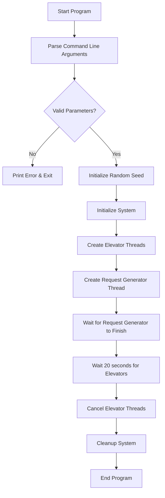
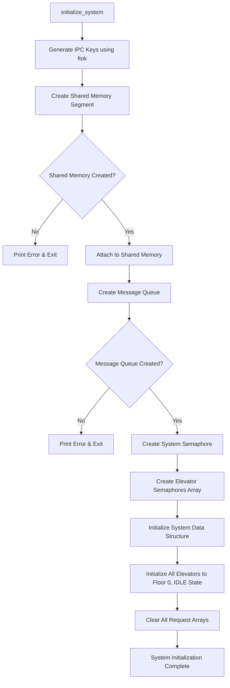
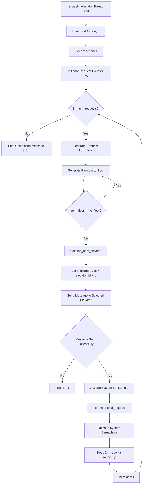
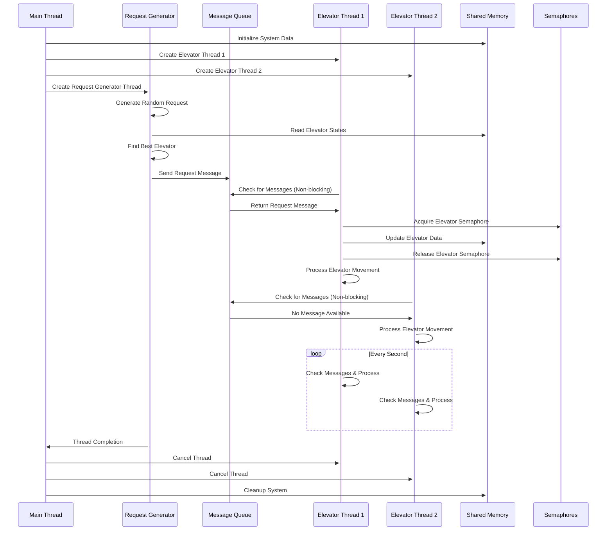
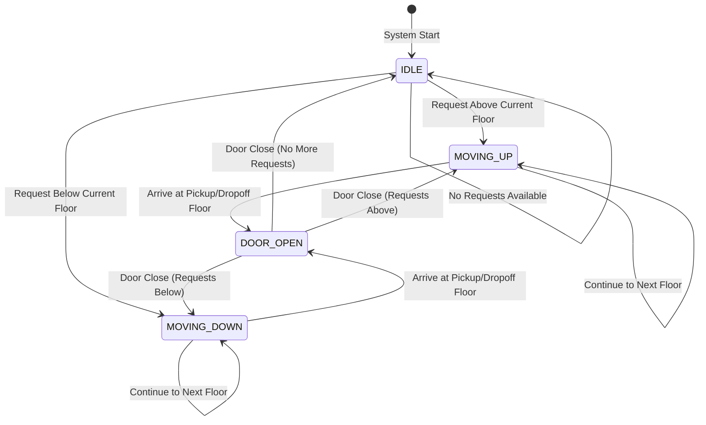
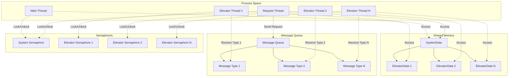
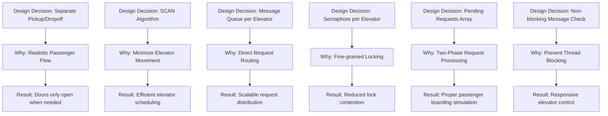

# Elevator Control System Flowchart

## Main Program Flow



## System Initialization Flow



## Request Generator Thread Flow



## Elevator Selection Algorithm Flow

```mermaid
flowchart TD
    A[find_best_elevator] --> B[Initialize best=0, min_distance=floors+1]
    B --> C[Acquire System Semaphore]
    C --> D[Initialize loop i=0]
    D --> E{i < num_elevators?}
    E -->|No| F[Release System Semaphore]
    F --> G[Return best elevator]
    E -->|Yes| H[Acquire Elevator i Semaphore]
    H --> I[Calculate distance = abs(current_floor - from_floor)]
    I --> J{Elevator State == IDLE?}
    J -->|Yes| K[distance -= 5]
    J -->|No| L[Calculate Required Direction]
    K --> L
    L --> M{Elevator Moving in Right Direction?}
    M -->|Yes| N[distance -= 3]
    M -->|No| O{distance < min_distance?}
    N --> O
    O -->|Yes| P[best = i, min_distance = distance]
    O -->|No| Q[Release Elevator i Semaphore]
    P --> Q
    Q --> R[Increment i]
    R --> E
```

## Elevator Thread Flow

```mermaid
flowchart TD
    A[elevator_thread Start] --> B[Print Thread Started Message]
    B --> C[Enter Infinite Loop]
    C --> D[Check for New Messages - Non-blocking]
    D --> E{Message Received?}
    E -->|Yes| F[Print Request Received]
    F --> G[Acquire Elevator Semaphore]
    G --> H[Mark pickup_requests[from_floor] = true]
    H --> I{Pending Count < 20?}
    I -->|Yes| J[Add Request to pending_requests Array]
    I -->|No| K[Release Elevator Semaphore]
    J --> L[Increment pending_count]
    L --> K
    K --> M[Call process_elevator]
    E -->|No| M
    M --> N[Sleep 1 second]
    N --> C
```

## Process Elevator Flow

```mermaid
flowchart TD
    A[process_elevator] --> B[Acquire Elevator Semaphore]
    B --> C{Pickup or Dropoff at Current Floor?}
    C -->|Yes| D[Set State = DOOR_OPEN]
    D --> E[Print Door Open Message]
    E --> F{Pickup Request at Current Floor?}
    F -->|Yes| G[Clear pickup_requests[current_floor]]
    G --> H[Process All Pending Requests for This Floor]
    H --> I[For Each Matching Pending Request:]
    I --> J[Mark dropoff_requests[to_floor] = true]
    J --> K[Increment passengers]
    K --> L[Remove from pending_requests Array]
    L --> M{Dropoff Request at Current Floor?}
    F -->|No| M
    M -->|Yes| N[Clear dropoff_requests[current_floor]]
    N --> O[Decrement passengers]
    M -->|No| P[Release Semaphore]
    O --> P
    P --> Q[Sleep 2 seconds - Door Open Time]
    Q --> R[Acquire Semaphore]
    R --> S[Set State = IDLE]
    S --> T[Print Door Closed Message]
    T --> U[Call find_next_stop]
    C -->|No| U
    U --> V{next_stop == -1?}
    V -->|Yes| W[Set State = IDLE, direction = 0]
    W --> X[Print IDLE Message]
    V -->|No| Y{next_stop == current_floor?}
    Y -->|Yes| Z[Release Semaphore & Return]
    Y -->|No| AA{next_stop > current_floor?}
    AA -->|Yes| BB[Set direction = 1, State = MOVING_UP]
    BB --> CC[Increment current_floor]
    CC --> DD[Print Moving UP Message]
    AA -->|No| EE[Set direction = -1, State = MOVING_DOWN]
    EE --> FF[Decrement current_floor]
    FF --> GG[Print Moving DOWN Message]
    DD --> Z
    GG --> Z
    X --> Z
```

## Find Next Stop Algorithm Flow

```mermaid
flowchart TD
    A[find_next_stop] --> B{Request at Current Floor?}
    B -->|Yes| C[Return current_floor]
    B -->|No| D{Direction == 1 (UP)?}
    D -->|Yes| E[Search floors above current_floor]
    E --> F{Found request above?}
    F -->|Yes| G[Return that floor]
    F -->|No| H[Search floors below current_floor]
    D -->|No| I{Direction == -1 (DOWN)?}
    I -->|Yes| J[Search floors below current_floor]
    J --> K{Found request below?}
    K -->|Yes| L[Return that floor]
    K -->|No| M[Search floors above current_floor]
    I -->|No| N{Direction == 0 (IDLE)?}
    N -->|Yes| O[Search all floors]
    O --> P{Found any request?}
    P -->|Yes| Q[Return that floor]
    P -->|No| R[Return -1 (No requests)]
    H --> S{Found request below?}
    S -->|Yes| T[Return that floor]
    S -->|No| R
    M --> U{Found request above?}
    U -->|Yes| V[Return that floor]
    U -->|No| R
    G --> W[End]
    L --> W
    Q --> W
    T --> W
    V --> W
    R --> W
    C --> W
```

## Thread Interaction Diagram



## State Transition Diagram for Elevator



## Memory and IPC Structure



## Key Design Decisions Flow


